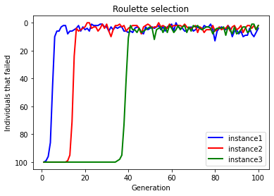
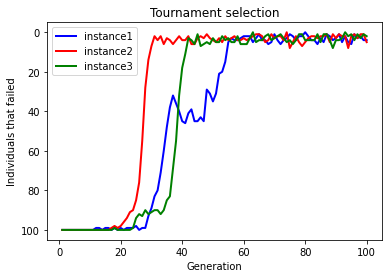
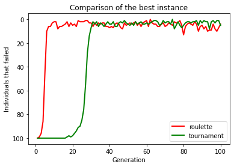

# SmartDots
SmartDots é o projeto final desenvolvido para a disciplina SSC0713-Sistemas-Evolutivos-Aplicados-a-Robótica. Inspirado no [Smart Rockets](https://shivank1006.github.io/Smart-Rockets/), o projeto tem como intuito aplicar os conceitos estudados em sala de aula e analisar como o algoritmo resolve o problema.

[Vídeo de Apresentação](https://drive.google.com/file/d/1W_L4lgKe_9tNLu3BC0Q6oWBerg-64kCb/view?usp=sharing)

## Autores

- [Pedro Henrique Magalhaes Cisdeli](https://github.com/sprmbng) - 10289804
- [Maria Eduardo Kawakami Moreira](https://github.com/madukm) - 11218751

## O problema

O problema consiste em uma população de bolinhas, no qual cada bolinha tem por objetivo chegar até um alvo definido sem colidir com os obstáculos no caminho.

### Fitness
O fitness é calculado baseado no inverso da distância euclidiana entre a bolinha e o alvo, ou seja, quanto mais perto do alvo, maior o fitness. Caso uma bolinha alcance o alvo, seu fitness é multiplicado por 10.

---

### Seleção
Foram utilizados diferentes métodos de seleção a fim de comparar qual se adeque melhor ao nosso problema:
- Elitismo: o melhor indíviduo (que possui maior fitness) cruza com todos os outros indíviduos.
- Torneio de 2: são realizados sucessivos torneios para definir os pais que cruzarão.
- Roleta: são selecionados n indivíduos aleatoriamente a partir de uma distribuição com probabilidades proporcionais ao fitness de cada indivíduo. Ou seja, indivíduos com maior fitness tendem a reproduzir com mais frequência que indivíduos com menor fitness, portanto eles têm maior chance de serem selecionados.

---

### Crossover
O crossover é feito utilizando o método tradicional de dividir os cromossos dois pais ao meio, gerando assim um filho que herda as características de ambos.

---

### Mutação
A mutação consiste na troca do valor de um gene do cromossomo. Portanto, para cada gene do cromossomo, a taxa de mutação define a probabilidade dessa troca ocorrer.

## Análise dos resultados
Testamos diferentes formas de seleção: elitismo, torneio de 2 e roleta. O elitismo foi o que mais demorou a convergir, e não foi possível testá-lo tão bem, portanto os gráficos a seguir mostram três instâncias da roleta e o torneio de 2.

Comparando os melhores de ambos métodos temos:

## Implementação
O projeto foi desenvolvido na linguagem de programação JavaScript, com auxílio da biblioteca p5 na parte gráfica.
A aplicação foi desenvolvida para ser usada em um monitor 16:9 com o browser em fullscreen.

